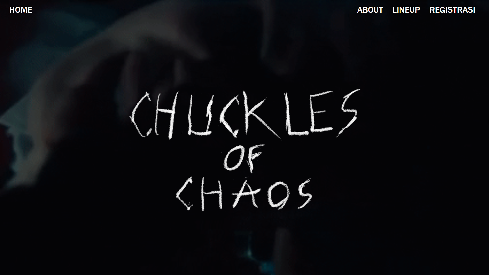

# **CHUCKLES OF CHAOS**

**Ini adalah landing page dari sebuah festival musik karangan sendiri.**

Pertama di [index.html](./index.html) saya membuat basic navbar dan membuat hero section dengan judul 'CHUCKLES OF CHAOS', menampilkan logo festival dan informasi tentang acaranya, seperti penjelasan tentang acara😁, tanggal, lokasi, line up band. dan saya juga
menambahkan bagian untuk pendaftaran yang pake button 'Daftar Sekarang' kalo diklik bakal ngedirect user ke halaman [registrasi.html](./registrasi.html). Di halaman registrasi saya ngebuat basic form untuk pendaftaran seperti input **username**, **email** dan **password** dan setelah user mengisi form user didirect ke halaman [confirmation.html](./confirmation.html) yang didalemnya cuma nampilin bahwa tiket masuk acara sudah dikirim ke email user dan ada link yang bakal ngeredirect user ke home page.

Di CSSnya cuma standar aja kaya nampilin background terus ngatur posisi sama spasi kaya gitu pake flex.

> acak acakan codingannya maaf pak😊
